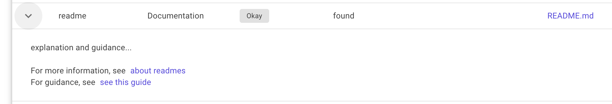

# Github Repository Analysis
Service that provides analysis and guidance for public github repositories. 

#### Status
[](https://github.com/balanikas/github-repository-analysis/actions/workflows/deploy.yml)
[](https://github.com/balanikas/github-repository-analysis/actions/workflows/codeql.yml)


#### Quality
[](https://sonarcloud.io/summary/new_code?id=balanikas_github-repository-analysis)

[](https://sonarcloud.io/summary/new_code?id=balanikas_github-repository-analysis)
[](https://sonarcloud.io/summary/new_code?id=balanikas_github-repository-analysis)
[](https://sonarcloud.io/summary/new_code?id=balanikas_github-repository-analysis)
[](https://sonarcloud.io/summary/new_code?id=balanikas_github-repository-analysis)
[](https://sonarcloud.io/summary/new_code?id=balanikas_github-repository-analysis)
[](https://sonarcloud.io/summary/new_code?id=balanikas_github-repository-analysis)
[](https://sonarcloud.io/summary/new_code?id=balanikas_github-repository-analysis)
[](https://sonarcloud.io/summary/new_code?id=balanikas_github-repository-analysis)
[](https://sonarcloud.io/summary/new_code?id=balanikas_github-repository-analysis)
[](https://sonarcloud.io/summary/new_code?id=balanikas_github-repository-analysis)

## How it works
Given a repository, the system will fetch all publicly available data for that repository,
evaluate it based on a set of rules, and present the results together with additional guidance.

https://user-images.githubusercontent.com/2317329/207807236-684bf53d-96c3-4c2c-ac73-c6d5389ab1fa.mov

## How to add a new rule
Lets add a rule that detects whether a readme file exists at the repository root.

#### Create the rule class
Create a rule class in an appropriate category. In this case we choose category `Documentation`
```csharp
public class ReadmeRuleApplicator : IRuleApplicator
{
    public string RuleName => "readme";
    public RuleCategory Category => RuleCategory.Documentation;
    public Language Language => Language.None; // set to None since the rule is language agnostic

    public Task<Rule> ApplyAsync(AnalysisContext context) =>
        throw new NotImplementedException();
}
```
#### Implement the rule
```csharp
    public async Task<Rule> ApplyAsync(AnalysisContext context)
    {
        // apply the rule using the context object
        var node = context.GitTree.FirstFileOrDefault(x => x.PathEquals("readme.md"));
        var (diagnosis, note) = GetDiagnosis(node);
        (Diagnosis, string) GetDiagnosis(GitTree.Node? n) =>
            n is not null
                ? (Diagnosis.Info, "found")
                : (Diagnosis.Error, "missing");
        
        // compose the results
        var rule = new Rule
        {
            Name = RuleName,
            Category = Category,
            Note = note,
            Diagnosis = diagnosis,
            Explanation = new Explanation
            {
                Text = "explanation and guidance...",
                AboutUrl = "https://about-readmes.com",
                AboutHeader = "about readmes",
                GuidanceUrl = "https://how-to-use-readmes.com",
                GuidanceHeader = "see this guide"
            },
            ResourceName = node?.Item.Path, 
            ResourceUrl = node.GetUrl(context)
        };

        return await Task.FromResult(rule);
    }
```

#### See the rule in the UI



For more info and to get started, see [the contributing document](CONTRIBUTING.md)

## About this service
This service is primarily targeted to small or medium sized repos,
that are owned by a single person or a small group of contributors.
It can be very useful to those getting started with open source projects, but also
for more experienced developers who want to do a quality check of their own repos.
A repository can be configured in many ways, and just because this service produces some warnings 
and recommendations based on assumptions and standard practices, doesn't mean that the repository
is in a definitive bad shape. 

The analysis is presented as a set of detections, where each detection is either
- `Okay` - looks good and no action needed 
- `Can be improved` - an action can be taken for improvement
- `Warning` - strongly recommended to address this

This service currently has extra checks for csharp repositories, but any repository should work.
For feedback, please create a new issue at https://github.com/balanikas/github-repository-analysis/issues
